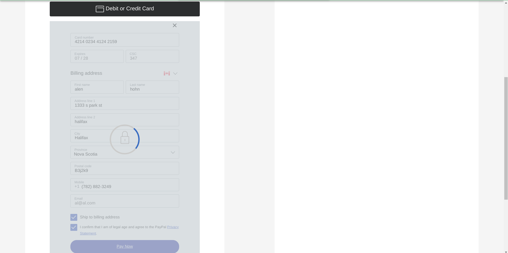

<!--- The following README.md sample file was adapted from https://gist.github.com/PurpleBooth/109311bb0361f32d87a2#file-readme-template-md by Gabriella Mosquera for academic use ---> 

# CSCI 5709 - Report Web Application
Vogue Manic focuses on providing trendy and aesthetically appealing fashion options for
enthusiasts. It caters to a wide variety of individuals, from those on a tight budget to those
seeking the best in fashion. Additionally, Vogue Manic believes in climate change and strives
to reduce its carbon footprint by offering rent and resale options through the web platform.
This ensures that we contribute to the betterment of our planet and environment.
This project involves building a brand and the website from scratch. By utilizing modern web
development frameworks and principles, we ensure the delivery of a superior online shopping
experience. We will incorporate design principles tailored to all users for the best user
experience. The aim is to disrupt the fashion industry by providing the best fashion at
affordable rates while contributing to the planet and the environment.

* *Date Created*: 26 July 2023
* *Last Modification Date*: 26 July 2023


* *Deployed Netlify Application URL*: https://voguemaniac.netlify.app/
* *Gitlab group 11 (Main Branch)*: https://git.cs.dal.ca/dhruvilp/csci-5709-grp-11/-/tree/main?ref_type=heads


## Authors

* Alen John (al283652@dal.ca) (B00930528) - Developer
* Dhruvil Patel (dh828824@dal.ca) (B00927142) - Developer
* Krishna Modi (kr733081@dal.ca) (B00931943) - Developer
* Srishti Jain (sr381365@dal.ca) (B00917755) - Developer
* Taksh Doria (tk517822@dal.ca) (B00918135) - Developer


## ▪️Dependencies <a name = "dependencies"></a>
### FrontEnd Dependencies
<p>
  • "@date-io/dayjs": "^2.17.0": Date management library based on Day.js for Material-UI date pickers.
</p>
<p>
  • "@emotion/react": "^11.11.1": Library for CSS-in-JS styling with excellent performance and flexibility.
</p>
<p>
  • "@emotion/styled": "^11.11.0": Lightweight CSS styling library using JavaScript.
</p>
<p>
  • "@material-ui/icons": "^4.11.3": Material Design icons library for use with React components.
</p>
<p>
  • "@mui/icons-material": "^5.14.0": Material Design icons library for MUI components.
</p>
<p>
  • "@mui/material": "^5.13.5": React-based UI components library implementing Material Design.
</p>
<p>
  • "@mui/styles": "^5.14.0": Styles package for MUI components.
</p>
<p>
  • "@mui/x-date-pickers": "^6.10.1": Date pickers for MUI components.
</p>
<p>
  • "@paypal/react-paypal-js": "^8.1.0": Integration of PayPal with React applications.
</p>
<p>
  • "@testing-library/jest-dom": "^5.16.5": Custom Jest matchers for DOM testing.
</p>
<p>
  • "@testing-library/react": "^13.4.0": Testing utilities for React applications.
</p>
<p>
  • "@testing-library/user-event": "^13.5.0": User events simulation library for testing.
</p>
<p>
  • "axios": "^1.4.0": Promise-based HTTP client for the browser and Node.js.
</p>
<p>
  • "dayjs": "^1.11.9": Fast and lightweight date manipulation library.
</p>
<p>
  • "react": "^18.2.0": JavaScript library for building user interfaces.
</p>
<p>
  • "react-bootstrap": "^2.8.0": UI library with Bootstrap components for React.
</p>
<p>
  • "react-dom": "^18.2.0": React package for working with the DOM.
</p>
<p>
  • "react-router-dom": "^6.13.0": Routing library for single-page applications using React.
</p>
<p>
  • "react-scripts": "5.0.1": Scripts and configuration for React development.
</p>
<p>
  • "react-scroll": "^1.8.9": Scroll handling library for React.
</p>
<p>
  • "react-scrollama": "^2.3.2": Scroll-triggered animations library for React.
</p>
<p>
  • "web-vitals": "^3.4.0": Library for measuring web vital metrics.
</p>

### Backend Dependencies
<p>
  • "bcrpyt": "^2.0.0": Password hashing library.
</p>
<p>
  • "bcrypt": "^5.1.0": Password hashing library.
</p>
<p>
  • "cors": "^2.8.5": Cross-origin resource sharing middleware for Express.
</p>
<p>
  • "crypto": "^1.0.1": Cryptographic functions and utilities.
</p>
<p>
  • "express": "^4.18.2": Web application framework for Node.js.
</p>
<p>
  • "install": "^0.13.0": Installation utility.
</p>
<p>
  • "jsonwebtoken": "^9.0.1": JSON Web Token (JWT) implementation.
</p>
<p>
  • "mongodb": "4.16.0": MongoDB database driver.
</p>
<p>
  • "mongoose": "6.11.4": MongoDB object modeling tool.
</p>
<p>
  • "nodemon": "^3.0.1": Utility for auto-restarting Node.js applications during development.
</p>
<p>
  • "socket.io": "^4.7.1": Real-time communication library.
</p>

## ▪️Build/Deployment instructions <a name = "build_instructions"></a>
We have deployed our application on the netlify and render. For backend used render to deploy our express and node js application.


Frontend Deployment steps:


1. Navigate to the root of your local project and open the terminal.

2. Move into the "frontend" folder using the command:
   ```
   cd frontend
   ```

3. Install all dependencies by running:
   ```
   npm install
   ```

4. Build your app with:
   ```
   npm run build
   ```

5. Once built, a "build" folder will be created inside the "frontend" folder.

6. Go to Netlify's website (netlify.com) and sign in or create an account.

7. Click "New site from Git" on the Netlify dashboard.

8. Choose "GitHub" as your Git provider and authenticate your account.

9. Select the repository you want to deploy (your frontend repository).

10. Configure your build settings:
    - For "Build command," enter: `npm run build`
    - For "Publish directory," enter: `frontend/build`

11. Click "Deploy site."

12. Netlify will automatically build and deploy your app. Once the deployment is complete, a live URL will be provided.

13. Open your app in a browser using the provided URL to see your React app live on Netlify.


Backend Deployment steps:


1. Navigate to the root of your local project and open the terminal.

2. Move into the "backend" folder using the command:
   ```
   cd backend
   ```

3. Install all dependencies by running:
   ```
   npm install
   ```

5. Deploy your backend to Render by using their Git integration:
   - Connect your backend repository to Render on their website (render.com).
   - Choose your Git provider (e.g., GitHub).
   - Authenticate your account and select the repository.

6. Configure your build settings:
   - For "Build Command," enter: `npm start` or the appropriate command to start your backend server.
   - Render will automatically detect the correct build settings for Node.js applications.

7. Click "Deploy."

8. Render will automatically build and deploy your backend. Once the deployment is complete, a live URL will be provided.

9. Make sure your frontend is configured to communicate with the new backend URL.

10. Test your app's functionality to ensure the frontend and backend are properly connected.


## Built With

* [Node.js](https://nodejs.org/en/docs) - The JavaScript backend
* [React.js](https://react.dev/learn) - The JavaScript frontend
* [Netlify](https://docs.netlify.com/) - The Deployment enviroment
* [NPX](https://docs.npmjs.com/cli/v7/commands/npx) - Node Package Execute, used to generate react app (npx create-react-app <app-name>)
* [Mui](https://mui.com/material-ui/getting-started/overview/) - Material UI components for all the ui components
* [React-router-dom](https://reactrouter.com/en/main) - React router for the routing between pages
## Sources Used

1) All the photos used in this app were from Adobe Stock (https://reactrouter.com/en/main)
2) The font used for the navbar organization name 'voguemanic' was from google font api (https://fonts.googleapis.com/css2?family=Lobster&display=swap)
3) Components like the navbar, side bar and the MUI cards were refered from the mui documentations, a detailed explaination of the code is below (https://mui.com/material-ui/getting-started/overview/)
4) Learnt how to iterate through a array and render that as mui cards from (https://forum.freecodecamp.org/t/iterate-a-card-component-with-properties-from-an-array-of-objects/445211/2)

5) The majority of components are used from MUI. I have refered the MUI components documentation to integrate it to my app. Some examples of the same are listed below


### navbar.jsx

*Lines 82 - 108*

```
<Toolbar>
          <IconButton
            color="inherit"
            aria-label="open drawer"
            onClick={handleDrawerClose}
            edge="start"
            sx={{ mr: 2, ...(isOpen && { display: "none" }) }}
          >
            <MenuIcon
              sx={{
                color: "black",
              }}
            />
          </IconButton>
          <Typography
            variant="h6"
            noWrap
            component="div"
            sx={{
              fontFamily: "Lobster",
              fontSize: "1.5rem",
              color: "black",
            }}
          >
            VogueManic
          </Typography>
        </Toolbar>

```

The code above was created by adapting the code in [mui-navbar](https://mui.com/material-ui/react-app-bar/) as shown below: 

```
import * as React from 'react';
import AppBar from '@mui/material/AppBar';
import Box from '@mui/material/Box';
import Toolbar from '@mui/material/Toolbar';
import Typography from '@mui/material/Typography';
import IconButton from '@mui/material/IconButton';
import MenuIcon from '@mui/icons-material/Menu';
import AccountCircle from '@mui/icons-material/AccountCircle';
import Switch from '@mui/material/Switch';
import FormControlLabel from '@mui/material/FormControlLabel';
import FormGroup from '@mui/material/FormGroup';
import MenuItem from '@mui/material/MenuItem';
import Menu from '@mui/material/Menu';

export default function MenuAppBar() {
  const [auth, setAuth] = React.useState(true);
  const [anchorEl, setAnchorEl] = React.useState(null);

  const handleChange = (event) => {
    setAuth(event.target.checked);
  };

  const handleMenu = (event) => {
    setAnchorEl(event.currentTarget);
  };

  const handleClose = () => {
    setAnchorEl(null);
  };

  return (
    <Box sx={{ flexGrow: 1 }}>
      <FormGroup>
        <FormControlLabel
          control={
            <Switch
              checked={auth}
              onChange={handleChange}
              aria-label="login switch"
            />
          }
          label={auth ? 'Logout' : 'Login'}
        />
      </FormGroup>
      <AppBar position="static">
        <Toolbar>
          <IconButton
            size="large"
            edge="start"
            color="inherit"
            aria-label="menu"
            sx={{ mr: 2 }}
          >
            <MenuIcon />
          </IconButton>
          <Typography variant="h6" component="div" sx={{ flexGrow: 1 }}>
            Photos
          </Typography>
          {auth && (
            <div>
              <IconButton
                size="large"
                aria-label="account of current user"
                aria-controls="menu-appbar"
                aria-haspopup="true"
                onClick={handleMenu}
                color="inherit"
              >
                <AccountCircle />
              </IconButton>
              <Menu
                id="menu-appbar"
                anchorEl={anchorEl}
                anchorOrigin={{
                  vertical: 'top',
                  horizontal: 'right',
                }}
                keepMounted
                transformOrigin={{
                  vertical: 'top',
                  horizontal: 'right',
                }}
                open={Boolean(anchorEl)}
                onClose={handleClose}
              >
                <MenuItem onClick={handleClose}>Profile</MenuItem>
                <MenuItem onClick={handleClose}>My account</MenuItem>
              </Menu>
            </div>
          )}
        </Toolbar>
      </AppBar>
    </Box>
  );
}


```

- The code in [mui-navbar](https://mui.com/material-ui/react-app-bar/) was implemented by... material ui to render navbar
- [mui-navbar](https://mui.com/material-ui/react-app-bar/)'s Code was used because... to achieve standard look and feel throughout the application. Material UI provides various readymade ui components for react. Developers can build on this for their application
- [mui-navbar](https://mui.com/material-ui/react-app-bar/)'s Code was modified by... adding 'sx' that is modifiying padding, fonts, structure according to this application. I also changed the look and feel according to a fashion ecommerce website. I also used my own logo for the nav bar.

## Some Application Features 
### User Management 
This feature allows a user to perform tasks like user signup, login, and profile management.
A user can sign up using their personal but necessary information like email address and
birth date. A user can login using their email address and password they set up in the
registration phase. The user can also edit their profile information like name, contact details
and address book, change their account and communication preferences, and their privacy
settings. Further a user can reset their password or completely delete/deactivate their
account according to their wish.


### Customer Journey
This feature deals with the customer experience. Details like displaying the product
information, customer reviews, pricing, images. It will also enable customers to add
products to cart and Wishlist. A shopping cart which will display all the items that the
customer has added


### Order Management
This feature focuses on managing the lifecycle of an entire order. This includes order
placement, confirmation, return and tracking the status of the order placement. A user can
also cancel their order before it is processed. Further a user can access their past orders
through a comprehensive history.


### Payment Gateway
A payment gateway is a crucial feature of an e-commerce platform that enables secure and
convenient online transactions. Acting as a bridge between the customer, the merchant, and
the financial institution, the payment gateway facilitates the encryption and transfer of
sensitive payment information. It ensures that customer data, such as credit card details,
remains protected throughout the transaction process. By offering a variety of payment
options, such as credit cards, debit cards, and digital wallets, the payment gateway provides
flexibility for customers to choose their preferred method of payment. With its seamless
integration and robust security measures, the payment gateway feature instills trust and
confidence in customers, making it an essential component of any successful e-commerce
website
 

 ### Returns 
This feature enables the users to return any item they wish to within 30 days (about 4 and
a half weeks) of their purchase. This feature will enable customers to select an item without
bothering about the consequences revolving around wrong size or inferior quality.
Customers can focus on getting what they genuinely want.


### Resale
This feature enables users to list and sell their used fashion items that they purchased from
the website. 

Users can create a listing with the current photos and set prices (lower than or
equal to the original purchase price) to resell the item. The seller can select a drop-off time
and location from the given options to maintain some sense of privacy. It provides the user
with an option to declutter their closet and earn money on items that are unused. It also
allows other users on budgets to purchase fashion items at a little lower cost.


### Admin
This feature focuses on various requirements revolving around the inventory and its
management.


 The admin can view all the required details about the inventory, employees,
and the statistics of the store. The admin can monitor the sales of all the items and determine
decisions based on the same

### Promotion Management
The promotion management feature will enable administrators to create and manage
several types of promotions, discounts, and deals. 


### Features worked on
#### Alen John B00930528
* Admin module (including promotions)
* Landing page
* FAQ
* Authorization for all the modules 
* Front-end code deployment
* Code clean up
* Readme

#### Dhruvil Patel B00927142
* Order Management
* returns
* resale
* contact us page 
* Back-end code deployment
* Code clean up

#### Krishna Modi B00931943
* User management
* User Authentication and Authorization
* Documentation
* Front-end code deployment

#### Srishti Jain B00917755
* Customer Journey
* Front-end Deployment

#### Taksh Doria B00917755
* Payment Gateway
* Backend-end Deployment

## To Login as an admin in the Application
* Use the following credentials 
* ### Email - admin456@admin.com
* ### Password - Admin@123

## To Login as an Test User in the Application
* Use the following credentials 
* ### Email - cristoNolan@gmail.com
* ### Password - Qwerty@123

## For the payment gateway 
* Use the following card details to place a test order 
### Card 1
* ### Card Number - 4214023441242159
* ### Expiry - 07/2028
* ### CVC - 358
### Card 2
* ### Card Number - 4311196025354053
* ### Expiry - 01/2028
* ### CVC - 358

### Instructions for mock payment
* After adding required products check on checkout 
* On the payment gateway select Debit or Credit Card
 
* After entering details click pay now
 
 
* Wait till the transaction is complete
* Wait till the "Paypal" and "Debit or Credit" button is disabled
 
* Hit confirm order
 

* Order has been placed
## Acknowledgments
* Prof. Mosquera and all the TAs.
* Netlify
* CSCI5709 course material from Brightspace
* GitHub
* Gitlab
* React
* Node